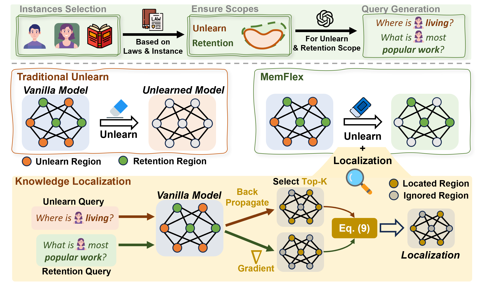

<h1 align="center"> KnowUnDo </h1>
<h3 align="center"> To Forget or Not? Towards Practical Knowledge Unlearning for LLMs </h3>

<p align="center">
  📃 <a href="https://arxiv.org/abs/2407.01920" target="_blank">arXiv</a> • 🤗 <a href="https://huggingface.co/datasets/zjunlp/KnowUnDo" target="_blank">Dataset</a> <br>
</p>

<div align="center">

[](https://github.com/zjunlp/KnowUnDo) 
[](https://opensource.org/licenses/MIT)
 


---

<p align="center">
  <a href="#-overview">🔔 Overview</a> •
  <a href="#-dataset">📊 Load Dataset</a> •
  <a href="#-how-to-run">🚀 How to Run</a> •
  <a href="#-citation">📖 Citation</a> •
</p>

</div>

# 🔔 Overview

<div align=center></div>

We provide the **KnowUnDo**, a benchmark containing copyrighted content and user privacy domains to evaluate if the unlearning process inadvertently erases essential knowledge. Access our **KnowUnDo** directly on [Hugging Face](https://huggingface.co/datasets/zjunlp/KnowUnDo).

To address this, we propose a simple yet effective method, **MemFlex**, which utilizes gradient information to precisely target and unlearn sensitive parameters.


# 📊 Load Datasets
You can easily load the datasets following below.

```python
from datasets import load_dataset

dataset = load_dataset("zjunlp/KnowUnDo", name='copyright', split='unlearn')
```
* Available configuration names and corresponding splits:
  - `copyright`: `unlearn`, `retention`;
  - `privacy`: `unlearn`, `retention`;

# 🚀 How to run
## Environment Setup
```bash
git clone https://github.com/zjunlp/KnowUnDo.git
cd KnowUnDo
conda create -n KnowUnDo python==3.10

conda activate KnowUnDo
pip install -e .
pip install -r requirements.txt

cd llm_unlearn/apex
pip install -v --no-cache-dir ./
```
## Download Large Language Models (LLMs)
```bash
# directory: KnowUnDo
mkdir models
cd models
git lfs install
git clone https://huggingface.co/meta-llama/Llama-2-7b-chat-hf
git clone https://huggingface.co/Qwen/Qwen1.5-7B-Chat
```
## Pretrain LLMs in Our Setting
```bash
# directory: pretrain
bash run_finetune_lora.sh
```
## Knowledge Localization (Optional)
We have released the localized knowledge region. You can perform the localization yourself as follows.
```bash
# directory: pretrain
bash run_localization.sh
```
## Prepare tokenized datasets
```bash
# directory: llm_unlearn
cd utils
bash tokenize_datasets.sh
```
+ `--val` for the `val` split of the dataset.
+ `--prompt` for concating `direct_prompt` before the `question` in the datasets.

## Unlearning experiments
```bash
# directory: llm_unlearn
bash run_baselines_lora.sh
  ```
## Eval Unlearned Model
<!-- ```bash
# directory: llm_unlearn
torchrun --nproc_per_node=1 --master_port=20001 run_eval_lora.py \
    --model_name_or_path /path/to/your/unlearned/model \
    --tokenizer_name ../models/Llama-2-7b-chat-hf \
    --per_device_eval_batch_size 1 \
    --do_eval \
    --output_dir ./output/copyright/Llama-2-7b-chat-hf-eval \
    --overwrite_output_dir \
    --overwrite_cache \
    --tf32 True \
    --domain copyright
``` -->
You can evaluate multiple unlearned models together by running our script **only once**.
```bash
# directory: llm_unlearn
bash run_eval_baselines_lora.sh
```
+ `--direct_prompt=True` means concating `direct_prompt` before the `question` in the datasets.
# 🎉 Acknowledgement

We would like to express our sincere gratitude to the excellent work [Unlearning LLM](https://github.com/yaojin17/Unlearning_LLM), [TOFU](https://github.com/locuslab/tofu), [LLaMA](https://huggingface.co/meta-llama/Llama-2-7b-chat-hf), and [Qwen](https://github.com/QwenLM/Qwen2?tab=readme-ov-file).

# 📖 Citation

If you use or extend our work, please cite the paper as follows:

```bibtex
@misc{tian2024forgetnotpracticalknowledge,
      title={To Forget or Not? Towards Practical Knowledge Unlearning for Large Language Models}, 
      author={Bozhong Tian and Xiaozhuan Liang and Siyuan Cheng and Qingbin Liu and Mengru Wang and Dianbo Sui and Xi Chen and Huajun Chen and Ningyu Zhang},
      year={2024},
      eprint={2407.01920},
      archivePrefix={arXiv},
      primaryClass={cs.CL},
      url={https://arxiv.org/abs/2407.01920}, 
}
```